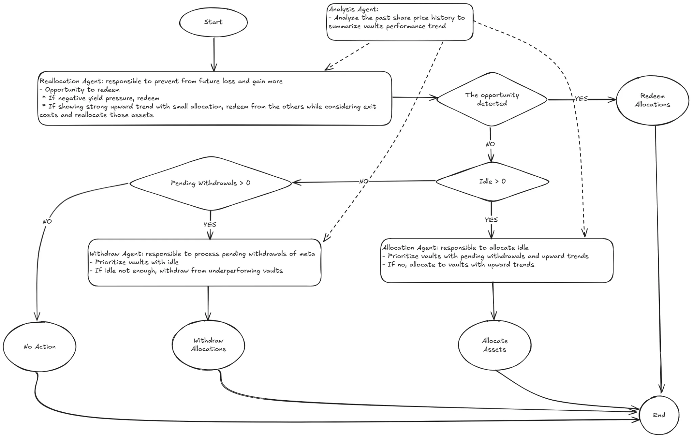

# Curator Agent

This agent is responsible for managing the assets of a meta vault to maximize profit. The meta vault allocates assets across multiple Logarithm vaults.

## Workflow of the Agent



## How to Perform a Backtest

1. **Install `uv`**  
   Install `uv` by running the following command:

   ```bash
   curl -LsSf https://astral.sh/uv/install.sh | sh
   ```

2. **Install Dependencies**  
   Synchronize the required dependencies:

   ```bash
   uv sync --locked
   ```

3. **Run the Backtest**  
   - **Step 1:** Build observations:
     ```bash
     uv run -m back_test.build_observations
     ```
   - **Step 2:** Generate backtest data:
     ```bash
     uv run -m back_test.curator_strategy
     ```

4. **Visualize Results**  
   View the results in chart format:

   ```bash
   uv run -m back_test.dashboard
   ```

   **Note:** Ensure the latest running log path is set in `dashboard.py` before running this step.